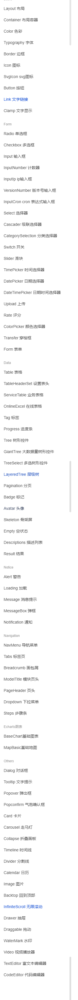

## 项目介绍

1. 改组件库是根据 elemen-ui 组件库优化

2. 新增多种使用组件
   
3. 组件内容比较丰富

## 项目启动

1. 安装依赖包

   ```shell
   npm install
   ```

2. 项目启动

   ```shell
   npm run dev
   ```

3. 打包

   ```shell
   npm run build
   ```

## 项目结构总览

| 目录     | 内容                                                                          |
| :------- | ----------------------------------------------------------------------------- |
| build    | 工程化相关配置和脚本（越到后越感叹 element 的工程化程度如此之高）             |
| examples | 官方文档项目（没想到 elementUI 官方文档也在组件库中，厉害，原谅我这碗水太浅） |
| lib      | 组件库打包后生成的文件（执行 npm run dist 即可生成）                          |
| packages | 组件库源码（各组件源码都在该目录，样式文件在 theme-chalk 中）                 |
| src      | 封装的公共方法和指令                                                          |
| test     | 测试脚本                                                                      |
| types    | 定义组件的类型                                                                |

### package.json 简单介绍

| 命令     | 作用                                                                      |
| -------- | ------------------------------------------------------------------------- |
| dev      | 启动组件库的本地开发环境，npm run dev，生成组件库的开发文档               |
| dev:play | 启动组件测试项目，npm run dev:play，用于验证开发的组件                    |
| dist     | 构建组件库, 生成 lib 文件，通过 npm 引入 elementUI，就是使用 lib 中的内容 |

​
​
​
